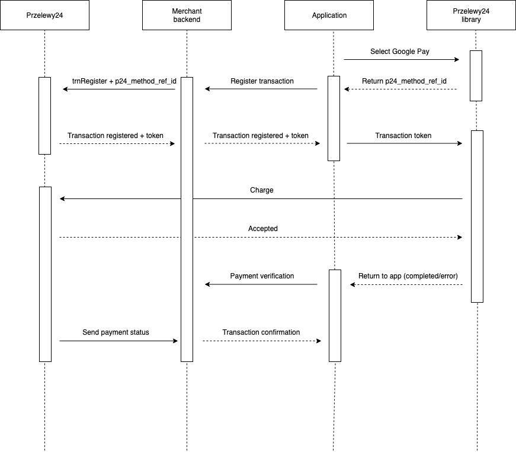

# Dokumentacja biblioteki Przelewy24 - Android

Ogólne informacje o działaniu bibliotek mobilnych w systemie Przelewy24 znajdziesz pod adresem:

- [https://github.com/przelewy24/p24-mobile-lib-doc](https://github.com/przelewy24/p24-mobile-lib-doc)

Przykład implementacji biblioteki:

- [https://github.com/przelewy24/p24-mobile-lib-android-example](https://github.com/przelewy24/p24-mobile-lib-android-example)

## 1. Konfiguracja projektu

Konfigurację należy rozpocząć od ustawienia wartości `minSdkVersion=14` w pliku `build.gradle`

### Dodawanie zależności

W środowisku Android Studio możliwe jest doadnie modułu biblioteki poprzez polecenie: „File → New → New module...”. Z listy „New module” wybrać „Import .JAR or .AAR Package” i kliknąć „Next”. W polu „File name” podać ścieżkę do pliku „p24Lib.aar”, jako „Subproject name” podać „p24Lib” i kliknąć „Finish”.

Kolejny krok to dodanie zależności do stworzonego modułu biblioteki poprzez modyfikację pliku `build.gradle` i umieszczenie w sekcji „dependencies” wpisu:

`implementation project(':p24lib')`

Biblioteka wykorzystuje bibliotekę AndroidX, dlatego należy różnież dodać zależność:

`debugImplementation 'androidx.appcompat:appcompat:+'`

Przykładowo sekcja „dependencies” powinna wyglądać tak:

```gradle

dependencies {
	//other dependencies
    implementation project(':p24Lib')
    debugImplementation 'androidx.appcompat:appcompat:1.0.0-beta01'
}

```

### Definiowanie pliku AndroidManifest

Do pliku `AndroidManifest.xml`, w węźle `manifest` dodać:

```xml
<uses-permission android:name="android.permission.INTERNET"/>
<uses-permission android:name="android.permission.ACCESS_NETWORK_STATE"/>
```

Następnie w węźle `application` dodać aktywność `TransferActivity`:

```xml
<activity android:name=„pl.przelewy24.p24lib.transfer.TransferActivity"
          android:configChanges="orientation|keyboard|keyboardHidden"
          android:theme="@style/Theme.AppCompat.Light.DarkActionBar”/>
```

__Wszystkie Activity w bibliotece dziedziczą po AppCompatActivity, dlatego należy do nich stosować style z grupy „Theme.AppCompat.*” i pochodne__

Przy domyślnych ustawieniach Activity podczas obrotu ekranu biblioteki nastąpi przeładowanie WebView, co może powodować powrót ze strony banku do listy form płatności i uniemożliwić sfinalizowanie transakcji. Aby okno biblioteki nie przeładowywało się konieczne jest ustawienie parametru:

```xml
android:configChanges="orientation|keyboard|keyboardHidden"
```
Przykładowo plik `AndroidManifext.xml` powinien wyglądać tak:

```xml

<?xml version="1.0" encoding="utf-8"?>
<manifest xmlns:android="http://schemas.android.com/apk/res/android"
    package="pl.przelewy24.p24example"
    android:versionCode="1"
    android:versionName="1.0.0">

	<!--other permissions-->
    <uses-permission android:name="android.permission.INTERNET" />
    <uses-permission android:name="android.permission.ACCESS_NETWORK_STATE" />

    <application >

		<!--other activities-->

        <activity android:name="pl.przelewy24.p24lib.transfer.TransferActivity"
                  android:configChanges="keyboardHidden|orientation|keyboard|screenSize"
                  android:theme="@style/Theme.AppCompat.Light.DarkActionBar"/>

    </application>

</manifest>

```

## 2. SSL Pinning

Biblioteka posiada mechanizm SSL Pinningu, który można aktywować globalnie dla wywołań webview.
Aby funkcja działała należy upewnić się, że przed wywołaniem jakiejkolwiek metody biblioteki jest ona odpowiedno zkonfigurowana. Przykład:

```java
SdkConfig.setCertificatePinningEnabled(true);
```

**UWAGA!!**

 > Aktywując SSL Pinning należy mieć na uwadze, że zaszyte w bibliotece certyfikaty mają swój czas ważności. Gdy będzie się zbliżał czas ich wygaśnięcia, Przelewy24 poinformują o tym oraz udostępnią odpowiednią aktualizację.

## 3. Wywołanie transakcji trnDirect

W tym celu należy ustawić parametry transakcji korzystając z klasy buildera, podając Merchant Id i klucz do CRC:

```java
TransactionParams transactionParams = new TransactionParams.Builder()
           .merchantId(XXXXX)
           .crc(XXXXXXXXXXXXX)
           .sessionId(XXXXXXXXXXXXX)
           .amount(1)
           .currency("PLN")
           .description("test payment description")
           .email("test@test.pl")
           .country("PL")
           .client("John Smith")
           .address("Test street")
           .zip("60-600")
           .city("Poznan")
           .phone("1246423234")
           .language("pl")
           .build();
```

Parametry opcjonalne:

```java
builder.urlStatus("https://XXXXXX")
       .method(25)
       .timeLimit(90)
       .channel(1)
       .transferLabel("transfer label")
       .shipping(0);
```
Następnie stworzyć obiekt z parametrami wywołania transakcji, odpowiedni dla danej metody:

```java
TrnDirectParams params = TrnDirectParams.create(transactionParams);
```

Opcjonalne można ustawić wywołanie transakcji na serwer Sandbox:

```java
params.setSandbox(true);
```

Mając gotowe obiekty konfiguracyjne możemy przystąpić do wywołania `Activity` dla transakcji. Uruchomienie wygląda następująco:

```java
Intent intent = TransferActivity.getIntentForTrnDirect(getApplicationContext(), params);
activity.startActivityForResult(intent, TRANSACTION_REQUEST_CODE);
```

Aby obsłużyć rezultat transakcji należy rozszerzyć metodę `Activity.onActivityResult`:

```java
@Override
protected void onActivityResult(int reqCode, int resCode, Intent data) {
    super.onActivityResult(reqCode, resCode, data);
    if (reqCode == TRANSACTION_REQUEST_CODE) {
        if (resCode == RESULT_OK) {
            TransferResult result = TransferActivity.parseResult(data);

            if (result.isSuccess()) {
                // success
            } else {
                //error
                String errorCode = result.getErrorCode();
            }
        } else {
            //cancel
        }
    }
}
```
`TransferActivity` zwraca tylko informację o tym, że transakcja się zakończyła. Nie zawsze oznacza to czy transakcja jest zweryfikowana przez serwer partnera, dlatego za każdym razem po uzyskaniu statusu `isSuccess()` aplikacja powinna odpytać własny backend o status transakcji.

## 4. Wywołanie transakcji trnRequest

Podczas rejestracji transakcji metodą "trnRegister" należy podać dodatkowe parametry:
- `p24_mobile_lib=1`
- `p24_sdk_version=X` – gdzie X jest wersją biblioteki mobilnej otrzymana w wywołaniu metody `P24SdkVersion.value()`

Dzięki tym parametrom system Przelewy24 będzie wiedział że powinien traktować transakcję jako mobilną. Token zarejestrowany bez tego parametru nie zadziała w bibliotece mobilnej (wystąpi błąd po powrocie z banku i okno biblioteki nie wykryje zakończenia płatności).

**UWAGA!**

 > Rejestrując transakcję, która będzie wykonana w bibliotece mobilnej należy
pamiętać o dodatkowych parametrach:
- `p24_channel` – jeżeli nie będzie ustawiony, to domyślnie w bibliotece pojawią się
formy płatności „przelew tradycyjny” i „użyj przedpłatę”, które są niepotrzebne przy płatności mobilnej. Aby wyłączyć te opcje należy ustawić w tym parametrze flagi nie
uwzględniające tych form (np. wartość 3 – przelewy i karty, domyślnie ustawione w
bibliotece przy wejściu bezpośrednio z parametrami)
- `p24_method` – jeżeli w bibliotece dla danej transakcji ma być ustawiona domyślnie
dana metoda płatności, należy ustawić ją w tym parametrze przy rejestracji
- `p24_url_status` - adres, który zostanie wykorzystany do weryfikacji transakcji przez serwer partnera po zakończeniu procesu płatności w bibliotece mobilnej

Należy ustawić parametry transakcji podając token zarejestrowanej wcześniej transakcji, opcjonalnie można ustawić serwer sandbox:

```java
TrnRequestParams params = TrnRequestParams
                      .create("XXXXXXXXXX-XXXXXX-XXXXXX-XXXXXXXXXX")
                      .setSandbox(true);
```

Następnie należy stworzyć `Intent` do wywołania `Activity` transakcji i uruchomić go:

```java
Intent intent = TransferActivity.getIntentForTrnRequest(getApplicationContext(), params);
activity.startActivityForResult(intent, TRANSACTION_REQUEST_CODE);
```

Rezultat transakcji należy obsłużyć identycznie jak dla wywołania "trnDirect".

## 5. Wywołanie transakcji Ekspres

Należy ustawić parametry transakcji podając url uzyskany podczas rejestracji transakcji w systemie Ekspres. Transakcja musi być zarejestrowana jako mobilna.

```java
ExpressParams params = ExpressParams.create(expresTransactionUrl);
```

Następnie należy stworzyć Intent do wywołania Activity transakcji i uruchomić go:

```java
Intent intent = TransferActivity.getIntentForExpress(getApplicationContext(), params);
activity.startActivityForResult(intent, TRANSACTION_REQUEST_CODE);
```

Rezultat transakcji należy obsłużyć identycznie jak dla wywołania "trnDirect".

## 6. Wywołanie transakcji z Pasażem 2.0

Należy ustawić parametry transakcji identycznie jak dla wywołania "trnDirect", dodając odpowiednio przygotowany obiekt koszyka:

```java
PassageCart passageCart = PassageCart.create();
PassageItem.Builder builder = new PassageItem.Builder()
           .name("Product name 1")
           .description("Product description 1")
           .number(1)
           .price(10)
           .quantity(2)
           .targetAmount(20)
           .targetPosId(XXXXXX);

passageCart.addItem(builder.build());
```

```java
TransactionParams transactionParams = new TransactionParams.Builder()
            ...
           .passageCart(passageCart)
           .build();
```

Wywołanie transakcji oraz parsowanie wyniku jest realizowane identycznie jak dla wywołania "trnDirect".

## 7. Google Pay

Proces przepływu danych przy użyciu tej metody płatności wygląda następująco:



By móc korzystać z płatności Google Pay należy najpierw dokonać dodatkowej konfiguracji projektu:

W węźle `application` proszę dodać aktywność `GooglePayActivity`:

```xml
<activity
    android:name="pl.przelewy24.p24lib.google_pay.GooglePayActivity"
    android:theme="@style/Theme.AppCompat.Translucent"
    android:configChanges="keyboardHidden|orientation|keyboard|screenSize">
</activity>
```

oraz umieścić odpowiedni wpis aktywujący usługę Google Pay:

```xml
<meta-data
    android:name="com.google.android.gms.wallet.api.enabled"
    android:value="true" />
```

Następnie w pliku `build.gradle` wymagane jest dodanie zależności do biblioteki Google:

`implementation 'com.google.android.gms:play-services-wallet:16.+'`


By zainicjować transakcję należy przekazać parametry transakcji oraz obiekt GooglePayTransactionRegistrar, który służy do rejestracji transakcji:

```java
GooglePayParams params = GooglePayParams.create(MERCHANT_ID, getItemPrice(), "PLN")
				.setSandbox(IS_SANDBOX);

Intent intent = GooglePayActivity.getStartIntent(this, params, getGooglePayTrnRegistrar());
startActivityForResult(intent, GOOGLE_PAY_REQUEST_CODE);
```

Interfejs GooglePayTransactionRegistrar pozwala na implementację wymiany tokenu otrzymanego z Google Pay na token transkacji P24. W momencie wywołania metody `register` należy skomunikować się z serwerami P24, przekazać token płatności Google Pay jako parametr `p24_method_ref_id`, a następnie tak uzyskany token transakcji przekazać do biblioteki za pomocą callbacka, wywołując metodę `onTransactionRegistered`.

```java
private GooglePayTransactionRegistrar getGooglePayTrnRegistrar() {
    return new GooglePayTransactionRegistrar() {
        @Override
        public void register(String methodRefId, GooglePayTransactionRegistrarCallback callback) {
            // register transaction and retreive token
            callback.onTransactionRegistered("P24_TRANSACTION_TOKEN");
        }
    };
}
```

Obsługa rezultatu wygląda następująco:

```java
@Override
protected void onActivityResult(int requestCode, int resultCode, Intent data) {
    super.onActivityResult(requestCode, resultCode, data);

    if (requestCode == GOOGLE_PAY_REQUEST_CODE) {
        if (resultCode == RESULT_OK) {
            GooglePayResult result = GooglePayActivity.parseResult(data);
            if (result.isError())
                showError("Google Pay error. Code: " + result.getErrorCode());

            if (result.isCompleted())
                showSuccess("Google Pay completed");
        } else {
            showCancel("Google Pay canceled");
        }
	} 
}
```

Więcej informacji o rejestrowaniu transakcji przez backend tutaj: [https://docs.przelewy24.pl/Google_Pay](https://docs.przelewy24.pl/Google_Pay).